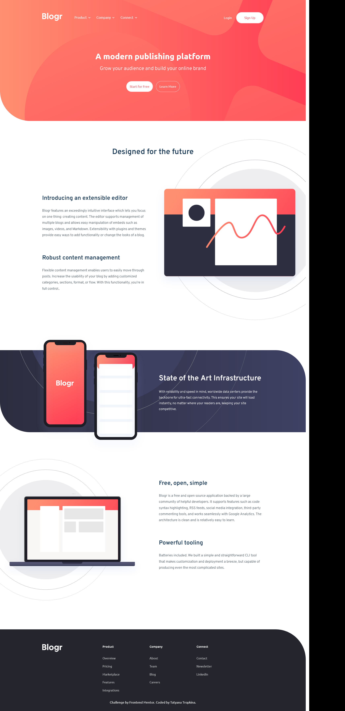

# Frontend Mentor - Blogr landing page solution

This is a solution to the [Blogr landing page challenge on Frontend Mentor](https://www.frontendmentor.io/challenges/blogr-landing-page-EX2RLAApP). 

## Table of contents

- [Overview](#overview)
  - [The challenge](#the-challenge)
  - [Screenshot](#screenshot)
  - [Links](#links)
- [My process](#my-process)
  - [Built with](#built-with)
  - [Useful resources](#useful-resources)
- [Author](#author)

## Overview

### The challenge

Users should be able to:

- View the optimal layout for the site depending on their device's screen size
- See hover states for all interactive elements on the page

### Screenshot

### Links

- Live Site URL: [Add live site URL here](https://tatyanatropkina.github.io/Blogr/)

## My process

### Built with

- Semantic HTML5 markup
- Bem methodology
- CSS custom properties
- Flexbox
- CSS Grid
- [jquery](https://jquery.com/) - jquery library

### Useful resources

- [spoiler](http://coderhs.com/spoilers_jq_alternate) - This helped me for spoiler for menu.

## Author
- Frontend Mentor - [@TatyanaTropkina](https://www.frontendmentor.io/profile/TatyanaTropkina)
- GitHub - [@TatyanaTropkina](https://github.com/TatyanaTropkina)

